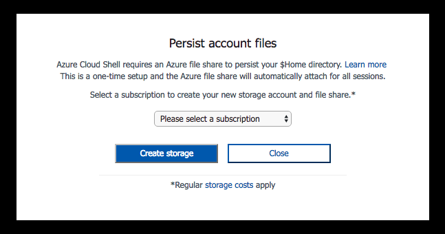

# <a name="get-started-with-azure-cli-20"></a>開始使用 Azure CLI 2.0

Azure CLI 2.0 是管理 Azure 資源的 Azure 新命令列體驗。
您可以透過 [Azure Cloud Shell](/azure/cloud-shell/overview) 在瀏覽器中使用，或者在 macOS、Linux 和 Windows 中[安裝](install-azure-cli.md)並從命令列中執行。

Azure CLI 2.0 已針對從命令列管理 Azure 資源進行最佳化，以及讓您建置可對 Azure Resource Manager 起作用的自動化指令碼。
本文可協助您開始使用 Azure PowerShell，並讓您知道其背後的核心概念。

如需最新版本的相關資訊，請參閱[版本資訊](release-notes-azure-cli.md)。

## <a name="connect"></a>連線

若要開始使用，最簡單的方案就是[啟動 Cloud Shell](/azure.cloud-shell/quickstart)。

1. 從 Azure 入口網站的頂端導覽啟動 Cloud Shell。

   

2. 選擇您想使用的訂用帳戶，並建立儲存體帳戶。

   

您也可以[安裝](install-azure-cli.md) CLI，並從本機命令列執行。

## <a name="create-a-resource-group"></a>建立資源群組

一切都已準備就緒，接下來我們要使用 Azure CLI 在 Azure 中建立資源。

首先，建立資源群組。  針對您想要以邏輯方式進行分組的多個資源，Azure 中的「資源群組」提供一個讓您管理這些資源的方式。  例如，您可以為應用程式或專案建立資源群組，並在該群組中新增虛擬機器、資料庫和 CDN 服務。

讓我們建立一個名為「MyResourceGroup」的資源群組，位置則定在 Azure 的 westus2 區域。  若要這麼做，請輸入下列命令：

```azurecli-interactive
az group create -n MyResourceGroup -l westus2 
```

建立資源群組之後，`az group create` 命令會輸出數個新建立資源的屬性︰

```Output
{
  "id": "/subscriptions/XXXXXXXX-XXXX-XXXX-XXXX-XXXXXXXXXXXX/resourceGroups/MyResourceGroup",
  "location": "westus2",
  "managedBy": null,
  "name": "MyResourceGroup",
  "properties": {
    "provisioningState": "Succeeded"
  },
  "tags": null
}
```

## <a name="create-a-linux-virtual-machine"></a>建立 Linux 虛擬機器

我們已擁有資源群組，接著我們要在其中建立 Linux VM。

您可以使用下列命令搭配常用的 UbuntuTLS 映像，以建立一個具有 10 GB 和 20 GB 兩個連結儲存體磁碟的 Linux VM︰

```azurecli-interactive
az vm create -n MyLinuxVM -g MyResourceGroup --image UbuntuLTS --data-disk-sizes-gb 10 20
```

當您執行上述命令時，Azure CLI 2.0 會尋找儲存在 ~/.ssh 目錄下的 SSH 金鑰組。  如果您還沒有儲存在該處的 SSH 金鑰組，可以要求 Azure CLI 為您自動建立一個，方法為傳遞 --generate-ssh-keys 參數︰

```azurecli-interactive
az vm create -n MyLinuxVM -g MyResourceGroup --image UbuntuLTS --generate-ssh-keys
```

在 VM 完全建立好並可供存取及使用之後，`az vm create` 命令會傳回輸出。 輸出會包含新建立 VM 的數個屬性，包括其公用 IP 位址︰

```Output
{
  "fqdns": "",
  "id": "/subscriptions/XXXXXXXX-XXXX-XXXX-XXXX-XXXXXXXXXXXX/resourceGroups/MyResourceGroup/providers/Microsoft.Compute/virtualMachines/MyLinuxVM",
  "location": "westus2",
  "macAddress": "xx-xx-xx-xx-xx-xx",
  "powerState": "VM running",
  "privateIpAddress": "xx.x.x.x",
  "publicIpAddress": "xx.xxx.xxx.xx",
  "resourceGroup": "MyResourceGroup"
}
```

VM 已經建立好，因此您可以搭配使用 **SSH** 與您所建立之 VM 的公用 IP 位址，來登入新的 Linux VM︰

```azurecli-interactive
ssh xx.xxx.xxx.xxx
```

```Output
Welcome to Ubuntu 14.04.4 LTS (GNU/Linux 3.19.0-65-generic x86_64)

 * Documentation:  https://help.ubuntu.com/

  System information as of Sun Feb 19 00:32:28 UTC 2017

  System load: 0.31              Memory usage: 3%   Processes:       89
  Usage of /:  39.6% of 1.94GB   Swap usage:   0%   Users logged in: 0

  Graph this data and manage this system at:
    https://landscape.canonical.com/

  Get cloud support with Ubuntu Advantage Cloud Guest:
    http://www.ubuntu.com/business/services/cloud

0 packages can be updated.
0 updates are security updates.


The programs included with the Ubuntu system are free software;
the exact distribution terms for each program are described in the
individual files in /usr/share/doc/*/copyright.

Ubuntu comes with ABSOLUTELY NO WARRANTY, to the extent permitted by
applicable law.

my-login@MyLinuxVM:~$
```

## <a name="create-a-windows-server-virtual-machine"></a>建立 Windows Server 虛擬機器

現在讓我們使用 `az vm create` 命令來建立以 Windows Server 2016 Datacenter 為基礎 VM，並將它新增至用於我們 Linux VM 的相同 "MyResourceGroup" 資源群組。  如同 Linux VM 範例，我們也會使用 `--data-disk-sizes-gb` 參數來連結兩個儲存體磁碟。

Azure 要求您避免使用輕易猜到的使用者名稱/密碼。 關於可使用哪些字元以及使用者名稱和密碼的最小長度，皆有特定的規則。  

> [!NOTE]
> 執行此命令時，系統會提示您輸入使用者名稱和密碼。

```azurecli-interactive
az vm create -n MyWinVM -g MyResourceGroup --image Win2016Datacenter
```

在 VM 完全建立好並可供存取及使用之後，`az vm create` 命令會輸出結果。

```Output
{
  "fqdns": "",
  "id": "/subscriptions/XXXXXXXX-XXXX-XXXX-XXXX-XXXXXXXXXXXX/resourceGroups/MyResourceGroup/providers/Microsoft.Compute/virtualMachines/MyWinVM",
  "location": "westus2",
  "macAddress": "xx-xx-xx-xx-xx-xx",
  "powerState": "VM running",
  "privateIpAddress": "xx.x.x.x",
  "publicIpAddress": "xx.xxx.xx.xxx",
  "resourceGroup": "MyResourceGroup"
}
```

現在，使用遠端桌面和 VM 的公用 IP 位址來登入新建立的 Windows Server VM (會從 `az vm create` 的輸出中傳回)。  
如果您是使用以 Windows 為基礎的系統，可以從命令列利用 `mstsc` 命令來執行此作業︰

```azurecli-interactive
mstsc /v:xx.xxx.xx.xxx
```

提供您在建立 VM 時所使用的相同使用者名稱/密碼組合來進行登入。

## <a name="creating-other-resources-in-azure"></a>在 Azure 中建立其他資源

我們已逐步瀏覽過如何建立資源群組、Linux VM 和 Windows Server VM。 您也可以建立其他許多類型的 Azure 資源。  

所有新的資源都會使用一致的 `az <resource type name> create` 命名模式來建立。  例如，若要建立 Azure 網路負載平衡器，然後與我們新建立的 VM 相關聯，我們可以使用下列 create 命令︰

```azurecli-interactive
az network lb create -n MyLoadBalancer -g MyResourceGroup
```

我們也可以使用下列 create 命令，為我們的基礎結構建立新的私人虛擬網路 (此網路在 Azure 中通常稱為 "VNet")︰

```azurecli-interactive
az network vnet create -n MyVirtualNetwork -g MyResourceGroup --address-prefix 10.0.0.0/16
```

Azure 和 Azure CLI 的功能之所以強大，是因為它們不只能用來取得以雲端為基礎的基礎結構，還能用來建立受管理的平台服務。  受管理的平台服務也可以結合基礎結構來建置更強大的解決方案。

例如，您可以使用 Azure CLI 來建立 Azure AppService。  Azure AppService 是一種受管理的平台服務，它可讓您裝載 Web Apps，而不必擔心基礎結構的問題。  在建立 Azure AppService 之後，您可以使用下列 create 命令在 AppService 內建立兩個新的 Azure Web Apps︰

```azurecli-interactive
# Create an Azure AppService that we can host any number of web apps within
az appservice plan create -n MyAppServicePlan -g MyResourceGroup

# Create Two Web Apps within the AppService (note: name param must be a unique DNS entry)
az webapp create -n MyWebApp43432 -g MyResourceGroup --plan MyAppServicePlan 
az webapp create -n MyWebApp43433 -g MyResourceGroup --plan MyAppServicePlan 
```

一旦您了解 `az <resource type name> create` 模式的基本概念後，建立任何項目都會變得很輕鬆。 以下是一些熱門的 Azure 資源類型，以及用來建立它們的對應 Azure CLI create 命令︰

```
Resource Type               Azure CLI create command
-------------               ------------------------
Resource Group              az group create
Virtual Machine             az vm create
Virtual Network             az network vnet create
Load Balancer               az network lb create
Managed Disk                az disk create
Storage account             az storage account create
Virtual Machine Scale Set   az vmss create
Azure Container Service     az acs create
Web App                     az webapp create
SQL Database Server         az sql server create
Document DB                 az documentdb create
```

若要深入了解您可以傳遞給每個先前命令的其他資源特定參數，以及您可以建立的資源類型，請瀏覽[參考文件](/cli/azure)。 

## <a name="useful-tip-optimizing-create-operations-using---no-wait"></a>實用秘訣︰使用 --no-wait 將建立作業最佳化

依預設，當您使用 Azure CLI 2.0 建立資源時，`az <resource type name> create` 命令會等候到資源已建立且可供使用為止。  例如，如果您是建立 VM，依預設不會傳回 `az vm create` 命令，直到 VM 建立且已就緒可供您進行 SSH 或 RDP 為止。

我們使用這種方法的原因是，它可讓您更輕鬆地撰寫自動化指令碼，當中包含具有相依性的多個步驟 (且在繼續執行之前需已順利完成先前的工作)。

如果您在繼續之前不需要等候資源建立，可以使用 `no-wait` 選項，在背景中啟動建立動作。 您可以針對其他命令繼續使用 CLI。

例如，下列的 `az vm create` 使用方式會啟動 VM 部署，然後更快速地傳回 (且在 VM 完全啟動之前)︰

```azurecli-interactive
az vm create -n MyLinuxVM2 -g MyResourceGroup --image UbuntuLTS --no-wait
```

使用 `--no-wait` 方法可以幫助您將自動化指令碼的效能大幅最佳化。

## <a name="listing-resources-and-formatting-output"></a>列出資源並設定輸出格式

您可以使用 Azure CLI 內的 `list` 命令，來尋找並列出 Azure 中執行的資源。 

例如，您可以利用 create 命令，使用一個在所有資源類型中皆一致的通用 `az <resource type name> list` 命名模式，將使用 Azure CLI 2.0 的資源列出。  有各種不同的輸出格式和查詢選項，可讓您以想要查看這些資源的方式，來篩選和排序資源的清單。

例如，`az vm list` 會顯示您擁有的所有 VM 清單。   

```azurecli-interactive
az vm list 
```
依預設，傳回的值為 JSON 格式 (為了保持簡潔，只顯示部分輸出)。

```json
[
  {
    "availabilitySet": null,
    "diagnosticsProfile": null,
    "hardwareProfile": {
      "vmSize": "Standard_DS1_v2"
    },
    "id": "/subscriptions/XXXXXXXX-XXXX-XXXX-XXXX-XXXXXXXXXXXX/resourceGroups/DEMORG1/providers/Microsoft.Compute/virtualMachines/DemoVM010",
    "instanceView": null,
    "licenseType": null,
    "location": "westus2",
    "name": "MyLinuxVM",
    "networkProfile": {
      "networkInterfaces": [
        {
          "id": "/subscriptions/XXXXXXXX-XXXX-XXXX-XXXX-XXXXXXXXXXXX/resourceGroups/demorg1/providers/Microsoft.Network/networkInterfaces/DemoVM010VMNic",
          "primary": null,
          "resourceGroup": "MyResourceGroup"
        }
      ]
    },
          ...
          ...
          ...   
]
```

您可以使用 `--output` 選項，選擇性地修改輸出格式。  使用易於閱讀的資料表格式選項，執行 `az vm list` 命令，以檢視稍早建立的 Linux 和 Windows Server VM 以及最常見的 VM 屬性︰

```azurecli-interactive
az vm list --output table
```

```Output
Name       ResourceGroup    Location
---------  ---------------  ----------
MyLinuxVM  MyResourceGroup  westus2
MyWinVM    MyResourceGroup  westus2
```

TSV 輸出選項可用來取得沒有標頭、以文字為基礎的定位字元分隔格式。  當您要將輸出輸送到另一個以文字為基礎的工具 (例如 grep) 時，此格式會很有用。 

```azurecli-interactive
az vm list --output tsv
```

```
None    None            /subscriptions/XXXXXXXX-XXXX-XXXX-XXXX-XXXXXXXXXXXX/resourceGroups/MyResourceGroup/providers/Microsoft.Compute/virtualMachines/MyLinuxVM        None    None    westus2 MyLinuxVM                   None        Succeeded       MyResourceGroup None                    Microsoft.Compute/virtualMachines       XXXXXXXX-XXXX-XXXX-XXXX-XXXXXXXXXXXX
None    None            /subscriptions/XXXXXXXX-XXXX-XXXX-XXXX-XXXXXXXXXXXX/resourceGroups/MyResourceGroup/providers/Microsoft.Compute/virtualMachines/MyWinVM  None    None    westus2 MyWinVM                 None    Succeeded       MyResourceGroup None                    Microsoft.Compute/virtualMachines       XXXXXXXX-XXXX-XXXX-XXXX-XXXXXXXXXXXX
```
請瀏覽[輸出格式](format-output-azure-cli.md)文件，進一步了解列出資源及設定輸出格式的其他方式。

## <a name="querying-resources-and-shaping-outputs"></a>查詢資源與成形輸出

通常您會想要能夠只查詢符合特定條件的資源。  

`list` 命令有內建支援，可輕鬆地依資源群組名稱篩選資源。  例如，您可以將 `--ResourceGroup` 或 `-g` 參數傳遞至 `list` 命令，只擷取特定資源群組內的這些資源︰


```azurecli
az vm list -g MyResourceGroup --output table
```

```Output
Name       ResourceGroup    Location
---------  ---------------  ----------
MyLinuxVM  MyResourceGroup  westus2
MyWinVM    MyResourceGroup  westus2
```

如需更強大的查詢支援，您可以使用 `--query` 參數，在任何 `az` 命令的結果執行 JMESPath 查詢。  JMESPath 查詢可用於篩選以及成形任何傳回結果的輸出。

例如，執行下列命令，在包含 "My" 字母的任何資源群組內查詢任何 VM 資源：

```azurecli-interactive
az vm list --output table --query "[?contains(resourceGroup,'MY')]" 
```

```Output
ResourceGroup    ProvisioningState    Name       Location    VmId
---------------  -------------------  ---------  ----------  ------------------------------------
MYRESOURCEGROUP  Succeeded            MyLinuxVM  westus2     XXXXXXXX-XXXX-XXXX-XXXX-XXXXXXXXXXXX
MYRESOURCEGROUP  Succeeded            MyWinVM    westus2     XXXXXXXX-XXXX-XXXX-XXXX-XXXXXXXXXXXX
```

然後我們還可以選擇進一步精簡輸出，方法為使用 JMESPath 查詢的成形能力來輸出不同的值。  例如，下列命令所擷取的 OS 磁碟類型，VM 會用來決定作業系統是以 Linux 還是 Windows 為基礎︰

```azurecli-interactive
az vm list --output table --query "[?contains(resourceGroup,'MY')].{ VMName:name,OSType:storageProfile.osDisk.osType }" 
```

```Output
VMName     OSType
---------  --------
MyLinuxVM  Linux
MyWinVM    Windows
```

Azure CLI 中的 JMESPath 支援很強大。  在我們的[查詢](query-azure-cli.md)文件中深入了解如何它的使用方式。

## <a name="deleting-resources"></a>刪除資源

您可以使用 Azure CLI 內的 `delete` 命令來刪除您不再需要的資源。 您可以搭配使用 `delete` 命令與任何資源，就像您使用 `create` 命令一樣。

```azurecli-interactive
az vm delete -n MyLinuxVM -g MyResourceGroup
```

依預設，CLI 會提示您確認刪除。  您可以隱藏這個自動化指令碼的提示。

```Output
Are you sure you want to perform this operation? (y/n): y
EndTime                           Name                                  StartTime                         Status
--------------------------------  ------------------------------------  --------------------------------  ---------
2017-02-19T02:35:56.678905+00:00  5b74ab80-9b29-4329-b483-52b406583e2f  2017-02-19T02:33:35.372769+00:00  Succeeded
```

您也可以使用 `delete` 命令，一次將許多資源刪除。 例如，下列命令會將資源群組 "MyResourceGroup" 中的所有資源刪除，之前我們將這個群組用於此快速入門教學課程中的所有範例。

```azurecli-interactive
az group delete -n MyResourceGroup
```

```Output
Are you sure you want to perform this operation? (y/n): y
```

## <a name="get-samples"></a>取得範例

若要深入了解如何使用 Azure CLI，請參閱我們針對 [Linux VM](/azure/virtual-machines/virtual-machines-linux-cli-samples?toc=%2fcli%2fazure%2ftoc.json&bc=%2fcli%2fazure%2fbreadcrumb%2ftoc.json)、[Windows VM](/azure/virtual-machines/virtual-machines-windows-cli-samples?toc=%2fcli%2fazure%2ftoc.json&bc=%2fcli%2fazure%2fbreadcrumb%2ftoc.json)、[Web Apps](/azure/app-service-web/app-service-cli-samples?toc=%2fcli%2fazure%2ftoc.json&bc=%2fcli%2fazure%2fbreadcrumb%2ftoc.json) 和 [SQL Database](/azure/sql-database/sql-database-cli-samples?toc=%2fcli%2fazure%2ftoc.json&bc=%2fcli%2fazure%2fbreadcrumb%2ftoc.json) 所提供的最常見指令碼。

## <a name="read-the-api-reference-docs"></a>閱讀 API 參考文件

[API 參考](/cli/azure)

## <a name="get-help"></a>取得說明

Azure CLI 有內建說明文件，用來比對您可以從命令列執行的 web 文件︰

```azurecli-interactive
az [command-group [command]] -h
```

例如，若要查看 VM 可使用哪些命令和子群組，請使用︰

```azurecli-interactive
az vm -h
```

若要取得建立 VM 的命令說明，請使用︰

```azurecli-interactive
az vm create -h
```

## <a name="switch-from-azure-cli-10"></a>從 Azure CLI 1.0 進行切換

如果您已經知道如何使用 Azure CLI 1.0 (azure.js)，會發現命令並不完全相同之處。
有時要執行工作的命令會有顯著的差異。
為了協助您從 Azure CLI 1.0 切換至 Azure CLI 2.0，我們已經開始進行這個[命令對應](https://github.com/Azure/azure-cli/blob/master/doc/azure2az_commands.rst)。

## <a name="send-us-your-feedback"></a>將您的意見反應傳給我們

```azurecli-interactive
az feedback
```
